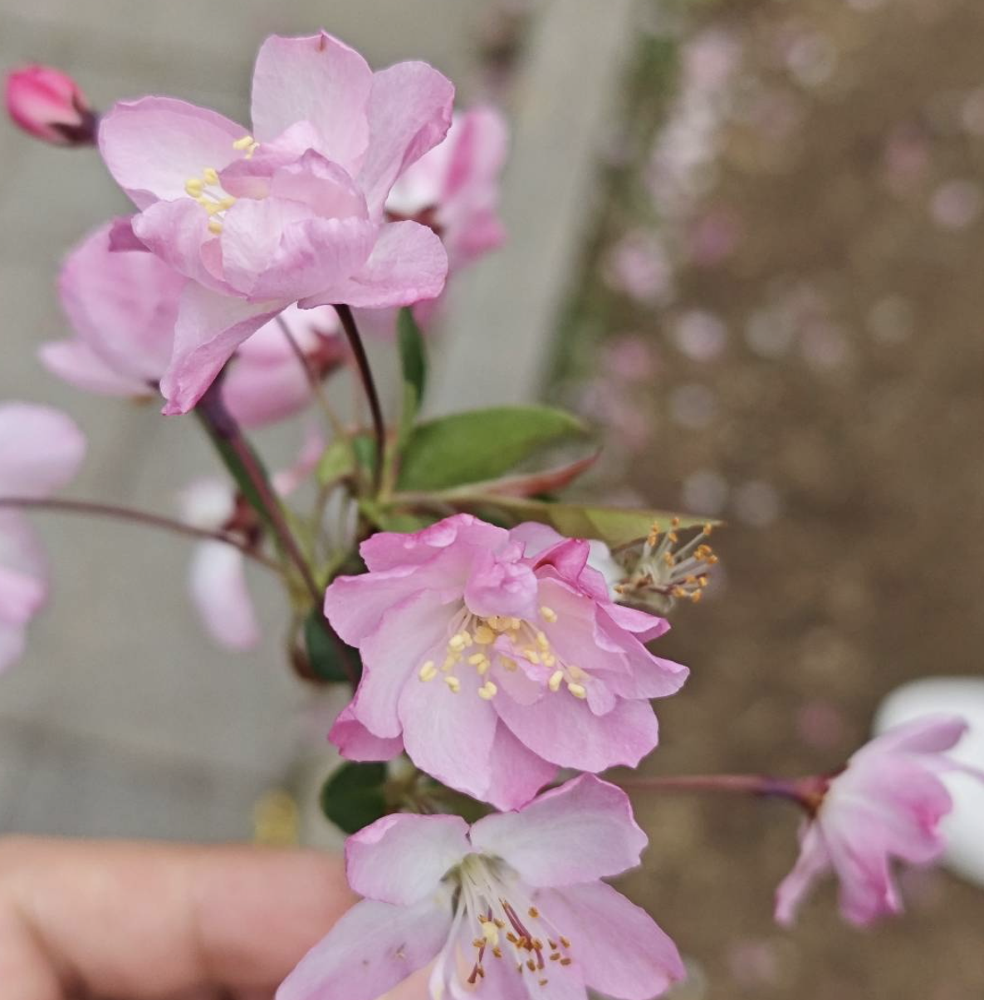
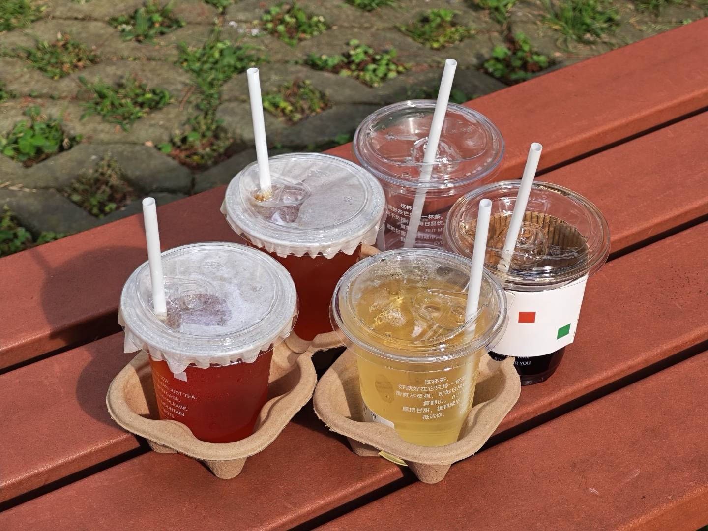
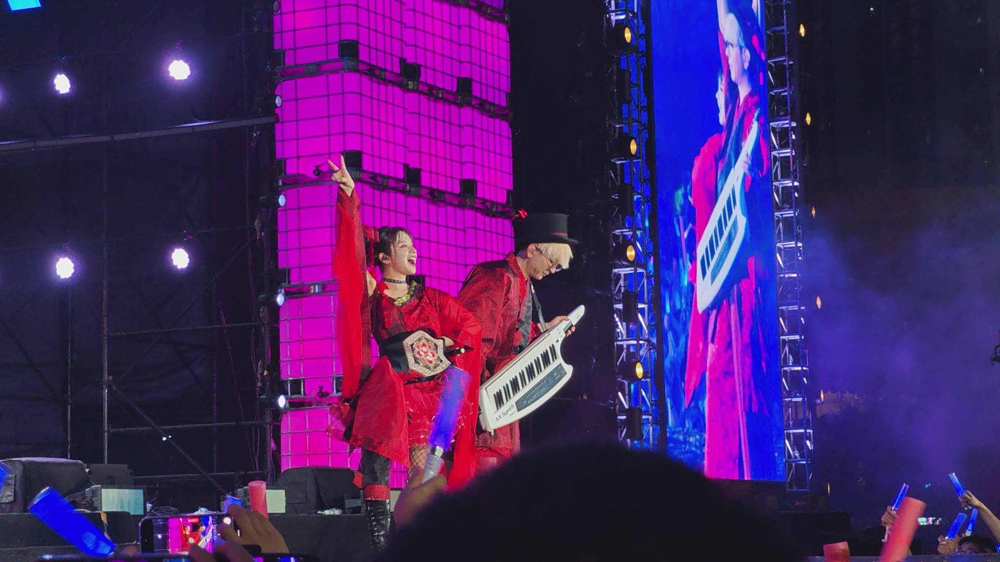
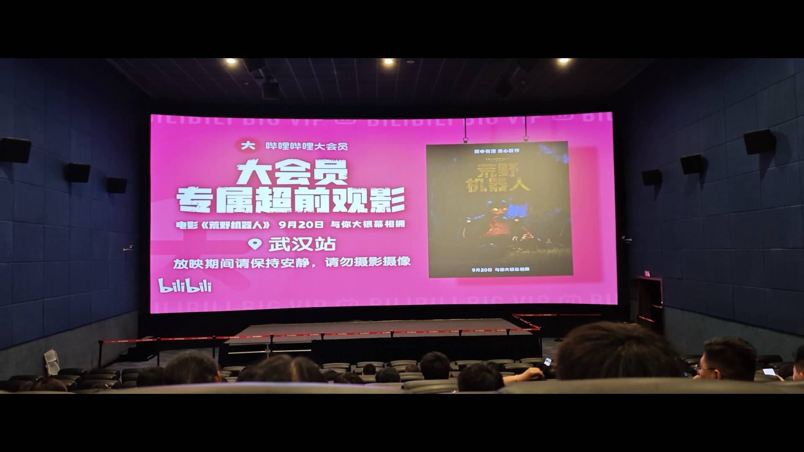
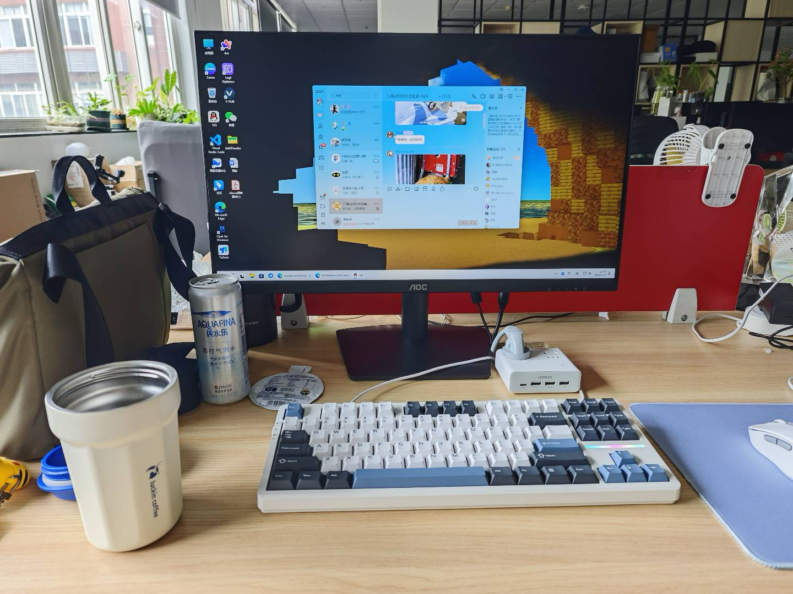
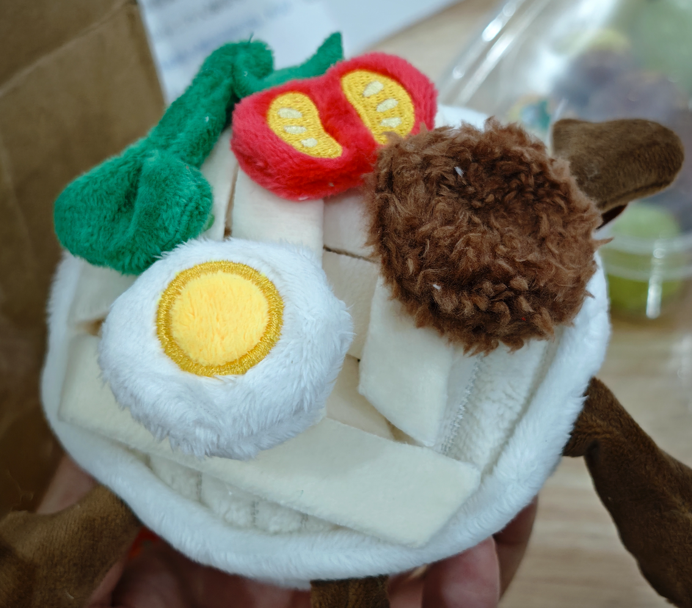
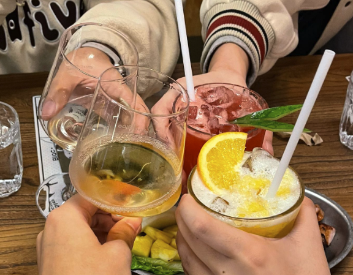

# REWIND 2024 - 向前走、回头看。

> 「你将失去记忆，忘了最初来自哪里，重启」
> 

# 写在开头 

想了很久，这一年的总结应该怎么开头。说不出来什么很场面的话也没有什么太惊天动地的事情，顺序播放又到了这首年度最佳。仔细想想自己这一二十年来的大大小小经历，也许真的是失去记忆了。

写下这一段文字的时候已经是快要24年结束的钟声，距离上一次写下这些东西已经记不起来是在哪一天了。随着时间推移很多事情都有了变化，很多东西也已经不再像从前那样，总是觉得有的时候应该记录一点什么东西才好，总算赶在这个时间暗下决心，一点点地重新把这个事情捡了起来。

于我而言，仍然是看似顺遂的一年。虽然中途总是会有点大大小小的问题但终究还是跨了过来，有时候不禁感慨自己一个人能够走到现在的这个境地真的是很有勇气，纵使自己会在做很多事情之前做好充分的准备，但还是会被“魔鬼”教唆就这么“冲动”一把。

关于这样的我，过去的不会再改变，未来的看起来也依旧如此。

---

# 过去不会、未来也不会 

仔细回想之后确实是在开始上学之后的十几年中唯一一次与朋友们共同度过的跨年夜，确实是十几年，之前有过和家人、和同学、和朋友，但是没有过和朋友“们”。大家默契地各自分配好了自己的时间，在约定好的时间一同闲逛、吃吃喝喝，在这之后又各自踏上了自己的路。返乡也好，工作也好，这些美好的回忆总是会陪伴着我们很久，直到现在我还能想起来那个晚上小小的花火映照在每个人脸上的笑容。

但有人并没有那么开心。总是会有一些外在的因素影响到人的心情，在半天的周六班结束后我还是没能够平息怒火。抄起手机去他的公司楼下接他去剪头发，编了一个理由请好了暂时休息的假，将他安顿好后辗转飞到老家忙家里的事情，很快回来后终于还是让他结束了这段不算友好的劳动关系。

眨眼已经是小年关头，第一年踏入职场的我还不知道会面对着什么，算是顺利地和同事一起结束了这一年。赶在与他纪念日的那一天做了这一年的分别，期待着新一年彼此能够变得更好，带着一年的思念回到家里，享受一下短暂的休憩。

---

# 过去二人、未来的二人 

一切照常开始，正如我们当时所约定的一样，与共同的朋友开始了三人合租的新生活。虽然大家早已算是交情甚深的好友，但是真到了这个程度，总是会有所相异的地方。不同的生活习惯总是需要一点多的时间来渐渐磨合，不同的生活方式也会偶尔给对方带来一丝不解，真实相处起来还是会有不少的磕磕绊绊，不同的身份也总是需要把握一点恰当的距离感才能够和睦相处。

一起度过了数十个平凡的日日夜夜、玩得还算尽兴的周末以及鲜有的异地短假，还是会被这些快乐的回忆充盈起来。每每想起这些时候总会觉得：朋友近在咫尺，真好。总归是让人感觉到幸福的一件事情，能够交到生活中的朋友是那么难能可贵。

但是总归没有办法万事顺遂，总是会有大大小小的问题浮现出来，一个又一个的谎只会编织出一个更大的谎言。“在敞开心扉之后面对的是什么？”我问过这位朋友，他也没能答上来，我也没有办法以己度人。还是选择了回到过去，希望这一次能够和解；而我也才明白什么样的方式才适合我们二人。

即便如此啊，朋友。我可能还没有办法能够帮到你更多，但是这段时间的回忆已经弥足珍贵了。至少我们有一同开心过、笑过、欣喜过，这样也就足够了吧。

---

# 过去不堪、未来才会好 

我早有想到会有这一天的出现，可是没有想到它会来得这么早。

在入职刚好半年的关头，公司开始出现了财务问题。本来正常运转的业务出现了下坡路，资金紧俏的同时还扩大了生产规模，入不敷出的情况开始频频发生，接连着三个月薪金发放都没有办法保证。我有想过这个地方会成为自己的跳板，因为实在是做了太多太多的事情了，尽管因为公司体量不算太大所以多做的事情也没有超出我的可接受范围，但频繁发生这样的事情最后还是在崩塌之前，逃离了。

靠着一点点积攒的经验接了一些小活勉强维持着生活水平不要出现太大变动，又像去年初来武汉一样辗转着不停面试和碰壁，总觉得这一次的自己因为有了一点真实的经验可以做得更好，但是现实并不这么觉得。好不容易有了一点眉目，一切看起来都很顺利，原来面试当天拿到offer这样的事情也会发生在我身上，抽了七管血做好体检之后等待入职流程，却被告知因为各种原因收回了本该发放的offer。得知消息那一刻的感觉我已经记不起来了，我甚至都不知道该如何形容，就好像是：吸进一大口气总算快要游向水面的时候用尽全力，结果发现因为用力过猛又潜入了旁边的鱼缸，而且因为太用力仿佛比上一次潜得更深了。

也许是这个时候就该触底反弹了吧，往后的一周里收到了三份面试邀约，并且收获了两份offer，一份看起来轻松无比而另一份中规中矩。不太敢冒险的我选择了后者，不因为别的，只是因为离家更近一点。事实证明这个选择无比正确，我过去的工作经验完全可以适用在新的岗位上，不出半个月就已经熟悉了整套流程。而这一次，不是当天拿offer的戏码，是提前转正和拿到了对于我自己的肯定。共事的大家都很和睦，leader人也很好，还算可以的工作压力刚好让我可以平衡生活和工作。

至少现在的我不会因为工作苦恼，至少我做的东西可以得到认可，至少过去工作里的纷乱都有了用武之地。

---

# 过去遗憾、未来与动力 

我是一个很少提及自己失败的人。

并不是，也许并不少。生活里发生的大大小小事总会被我有意或无意地和朋友们一一倾诉。拿得起的东西很多，放得下的却还是很少。即便我已经几乎能够打点好一切了，即便能够在我自己看来安排好是是非非的发生。我觉得自己已经做得足够好了，也许完全不应该被挑出来毛病。

但是吧，总归不是所有的人都会吃这一套的。这是我的问题，也许也不是我的问题。

今年也认识了新朋友，去到了新的地方。比起开拓更多城市落下更多足迹，这个我确实没有做到，但是和新的朋友重新开拓了更大的老的地图。至于对哪里的印象比较深刻，我也想不太出来，但是新的朋友带我领略的新景色我也许会回顾很久，有些是纯粹的快乐，有些是这辈子可能都不会和自己和解的遗憾。也许听起来很悲壮，但是正是这些东西才能化作我自己的动力，一直以来都是如此。

现在的我还是会觉得处理好人际关系很累，有的时候不想花这么多的精力：可是处理好了又怎么样呢，省下来的精力又能去干什么事情？我不知道，也许累了最好还是大睡一觉，这样就好。

现在的我还是会觉得低人一头的学习不好，很难说曾经的自己有没有好好努力：可是我是头头啊，低人的那一头我加在称呼里就好了。曾经努力了也不会是现在的我，现在我还不错，这样就好。

现在的我还是会觉得能够尽所能做到一切，有的时候会因为这样产生距离感：可是那个时刻我们是实实在在的开心了，至少这一点我做到了。这笔帐留在后面算，我也会有满足感，这样就好。

现在的我也会从过去的点点滴滴里慢慢学习，这就足够了。我当然没有办法，没有办法做到迅速地吸收消化过去的一切，在下一次时避开所有的错误选项，成为那个标准答案。

但是如果今天没做完的事情明天至少能够做好一半的话，好像也不错吧？

生活不是赶ddl，放缓脚步慢慢走，要是脚印没踩出来倒着走两步也可以，总归是向前走就好。

> 「认真的每一次呼吸，烟花的绚烂就不算虚拟。」
> 

---

## 写到这里已经差不多啦，但是看起来好像都是一些感悟的内容？ 

### 还有一些我觉得值得记忆的东西 ⬇️ 

### 今年的樱花季 

也看啦，和不同的朋友们一起看的。前前后后分别在江滩、东湖、武大留下了足迹，有的时候还是会想要随着人流跟风一下走走看看。也没有什么很特别的理由和意义，总之就是想。也许是在看到熙熙攘攘攒动的人头同时能够更真切的感受到时间的流逝。从未停下，也无法停下。花期很短，待到最后一场的时候，还是捧起来掉落在地下的花枝留下了这张照片，随后又放回原来的位置，即便我能够将它带走，带回家里，带去更远的地方，但是终究还是不属于它的，也不会属于我。

### 一杯一杯一杯一杯 

今年真的做了很多很多杯喝的东西，记不清了也没有每次都拍下来，总之是做了很多次。试着学习了调含酒的饮料，还有不同的咖啡等等。漂亮的分层也包含着不同的口感，但总是会因为吸管的搅动慢慢混合在一起，合而为一。体会着个中滋味或混合、或有层次感、或者干脆就是完全不同的味道在嘴里化开，怎么不算是一场场对于味觉的探索呢？

### 抢救一杯复制山 

其实是一杯一杯一杯一杯一杯复制山。在社媒上看到了即将闭店的消息和朋友一同去抢救性消费，但是很幸运的是它居然活下来了，虽然位置更偏了一点，但是我还是愿意偶尔喝一次。甚至还开了新的分店，我不知道该怎么评价这种味道，也许是的，他很平淡，和口感更丰富的咖啡果茶等等不算那么出彩。但是没关系，我也需要一点平平淡淡的抚慰，就像这杯纯茶。（但是我上家公司没有活下来）

### 我去，痛包怎么痛的是我！ 

家人们怎么办遇到真的二次元了，怎么办啊在线等挺急的。和这位朋友在这一年度的最后一次碰面，虽然只是一个周末，平平无奇，但也是平平无奇的充实与幸福。一起逛展、探店、吃了不知道多少次的干煸藕条，还是能够令人开怀满足。不知道我们上辈子有过多少次擦肩而过、有过多少次点头之交，但是这一世我们相识相知，在楼下等你出现时能够给我一个热情的拥抱，在驻足停留时为你捧上一杯热饮。这就足够了，也祝你一切顺遂，enjoy your ride。

### 我就是咖啡大头 

嗝。早上帮同事带了咖啡结果同事因为身体原因没办法喝，结果又被好友同时投喂了我们两人，这下好了直接一喝喝一天。（完完全全喝饱了）回想一下，这是我在正式工作里结交的第一位同事，没有那么无话不谈但也是站在同样的位置，会因为生活里的大大小小事互相分享，甚至还有给我带过她自己做的菜饭，在我离职后还会和我分享生活点滴，叫我出来一起玩，十分融洽的关系，十二分好的同事。

### 和朋友一起溜了冰！ 

其实是在欢乐谷看了GARNiDELiA，hai-hai-hai-hai-。同在欢乐谷的是赶着某天刚好下雨的过山车，总算拉着朋友一起上了过山车结果刚坐下来就是大雨，我大概已经记不起来旁边的朋友叫的多大声了但是被雨水打的根本不敢睁开眼睛不敢张嘴，害怕吗？有一点，主要是害怕雨水都被我喝进去了，简直是此生难忘的过山车经历+1。

### 是签绘！ 

离职后在家休憩的时间里和群友一起在上海玩了两天！和大家窝在一起吃吃喝喝什么的～有给大家做饮料还有一起在KTV唱歌！也是很久没有开过口了但是好像还算能听吧最近自己在家也偶尔会嚎歌什么的，希望有机会可以好好录一首发出来哇。（真的发吗？）同样也有对“魔都”这个地方多一点点看法，好像于我而言，这些地方都是曾经很向往的城市，但是现在我也许还是想再多探索一下江城，再留意下一点自己的痕迹，留下一点回忆。

### 最后的悠闲夏日 

为什么是最后，是因为离职才有的暑假。（社畜哪有暑假的啊）虽然是有点懒惰和情绪低落的时候在，但总归是要生活的，吃好喝好一切才会更好！记得因为某次面试结束后觉得一定没戏了，在楼下的MANNER点了一杯北冰洋美式，结果到手快喝完了才发现店员递给我的是便宜5块钱的冰橙美式。天塌了，面试没戏就算了怎么喝的也被偷换了，简直是哭笑不得，不过后续是下午有收到新的面试邀约，虽然到最后没有去到这家公司，不过还是很感谢这个面试机会，让我第一次体验了一下什么叫全英文面试。

### 超前观影！ 

趁着大会员抽到的资格去看了荒野机器人，感觉毕业之后看电影的频率明显上升，有什么新片都会考虑去看一下，上学的时候反而没有这种感觉。（为啥呢，因为懒吗）然后最近的一次柯南新片就没有被抽到了，好可惜。下次有机会一定要早点抢，不然给叔叔交的保护费都白白废掉了啊。

### 新工作极简（乱）工位预览 

是很棒的公司～ 丝滑入职了！这么来看从上家公司离职后简直是什么都没有带走，不过无所谓了，毕竟是个没什么美好回忆的地方，还好自己早早跑了不然现在还是拿不到那几个月的工资。新公司各种福利都还算到位，和同事相处也很融洽，还有弹性工时，而且也是自己喜欢的领域和职位，

### 年度仪式感已就位 

小米15/Pro终于摸起来不硌手了！手感真的舒服很多，其实同年也换了主力的iOS设备，但是那一边的只是工具，这一边的才是我已经频频记录着的生活。每年一换会有什么新的感觉？不太清楚，至少是在我能够承受的范围内带来的一点新鲜感，我依旧会购入更多的设备体验更多不同，渐渐满足曾经那个会翻看无数个测评视频的自己。不过这一次是亲自上手体验，并非隔着屏幕，虽然长大了还是免不了回头看看曾经那个自己，但是我很满意，我愿意为自己这么做。

### 永远 永远 永永远远 喜欢ChiliChill！ 

文中的歌词引用均来自ChiliChill的《混入人类计划》一曲，是我今年非常喜欢的曲子。非常喜欢的歌词和旋律，是我愿意顶着调休下班狂奔到现场大声唱出来的程度。全程跟唱下来依然非常爽，唯一可惜的是我到现场的时候CD已经卖光了，感谢好友的代购！圆梦了！（放一下当时拍的视频[在这里](https://b23.tv/bkwT60Q)）

live结束后去了汤泉过夜，夜宵吃吃吃喝喝喝，十分惬意的一晚，早饭吃吃吃喝喝喝，离开前又一次被温水包裹着。终于感觉到这一段落的疲倦和不堪被洗刷一空，继续带着所有的美好回忆接着生活接着努力下去吧。

偶对了，还有啊，终于买了CD机，收集了所有BUMP OF CHICKEN的专辑，想到之前看到的一条评论：总是会在一些时候听BUMP的歌，虽然有的时候没有继续听了，但是总在那里给我力量。今年没有听那么多BUMP去说服自己，但是也借由他们圆满了这个小小愿望。是的，也许到什么时候我又会开始继续听BUMP了，也许那个时候我又会有点失意，但是总是他们在陪着坚持下去，非常幸运。

### 非常可爱的山西版JellyCat刀小面 

（谐音梗是吧）高中时候很好的玩伴送的，愣是年初问到年尾了还给我寄来了，整个一个感动住了。（可能更多的是想回家吃刀削面）思来想去，又是一年春运了，也该回家看看了。在头头咖啡屋的前身某T的小窝时候我有记录到不恋家的自己和离家时候的别样滋味，很难说自己是一个恋家的人，但是也很难割舍这一切的一切，是所有的这些一起，造就了现在的我。

### 非常好看的红枫叶 

当天在现场的时候天气没有太好，太阳偶尔出现一下，当时刚开始看到零零落落的红枫还有点失望来着。不过现在回看当时的照片还是非常好看。（还好拍了）遮遮掩掩的两人还是互相为对方留下了印记，认真回看之后发觉这一年记录对方的东西确实不是很多，可能是平平淡淡的生活温柔无奇，也可能只是我太懒了，总之既然已经写下了这些话，就还是要拾起来了。

### 畅饮，爽！ 

是第一次和朋友们一起在外面嚯酒。很多种口味喝到最后我现在已经不记得最好喝的那个是哪一款了，不过不是很重要，重要的是那晚上很开心，好像大多数时间还是保持理智的最后还顺利地叫车回家了，可能偶尔也会想要来一次醉醺醺的感觉吧。我依然会觉得酒不算是什么太好的东西，但是现在会觉得，也会想去尝试这样的感觉。

### 恭喜一下当时的自己，提前转正！（特别好玩的HR） 

本来因为工作年限不够没有捞到的，但可能是因为持续的推（骚）销（扰）使这位HR最终还是愿意和我聊一聊，面试当天上午从10:30聊到了13:00，据说是很少见的很久的面试时间，并且在当天基本确定了工作意向，也就是在这场面试的过程中收到了另外一家offer letter，心中终于是有了底气，选择这份离家更近的工作，事实证明是无比正确的选择，不然就要去教小孩子们IT课了。

### 冬至晚上一起喝了热乎乎的羊汤 

因为当晚的人很多所以是坐在户外的棚子里围着炭火炉边煮边喝的。中途加了两次（还是三次）汤，总之越喝越咸。（但是好喝，下次不喝大锅了喝小碗装吧）果然这样的天气还是适合一碗热乎乎的汤才舒服。当然，更舒服的可能是因为有人陪在我左右吧，不管是怎么样，这碗汤都是没有错的。

---

## 最后的最后 

就是各位进来看上面废话之前主页的头头本头啦。在确定要写这一年的REWIND时还没有决定好是什么主题，也许还是像往常几年一样放一堆图片吧，然后记录一下当时发生的事情，虽然今年也是这么做了但还是矫情地写了一些其他东西。很凑巧的是，刚好在这个关头收到了这张稿子。

对于我来说，不管是Tito还是头头，都是我。我没有那样的想象力为自己的形象创立一整个世界观，也没有什么幻想的元素加在这里。头头就是Tito，Tito就是我。希望即使是这个样子的自己，也可以尽可能贴合实际、贴近生活、贴近自己。[画师老师](https://x.com/FrankUwu71426)有把我想传达的东西很好地表达出来，一直以来的穿搭风格加上贴近日常的有生活感的姿势动作，给了我很大的启发和帮助。也祝他能够收获更多的肯定，行往景致开阔之地，实现更大的构想。

最终，决定下来这一年的REWIND主题 —— **向前走、回头看。** 

还有你，我的朋友。感谢这一路走来的种种支持，辛苦你了。

ENJOY THE RIDE.