# 这些我、组成我。

写下的每一段故事都伴随着每一个阶段的我，幼稚也好天真也好、装模作样也好尴尬收场也好，回想起来从自己有意识想要记录一些东西的时候，已经是刚刚离开家里上大学时候的事情。偶然注册了一个公众号，有时候想到什么就写点什么，有时候只是自怨自艾的发一些很 emo 的文案，一边写一边回忆到一些很阴湿的男大时光。嘴里念叨着什么“活到 45 岁结识一个仇家然后被他杀”，什么“总是把对自己最好的人越推越远”，什么“一直以来的照顾都谢谢了”怎么怎么的，难以想象曾经的脑子到底每天都在想些什么，人甚至无法共情和理解过去的自己，大概就是这样的一回事吧。

记得去年的时候写道，要重新拾起记录生活的习惯，学会随手记录眼前看到的景象，结果随着生活中的各种组成越来越多越来越忙，终究还是没有达到自己想要的更新频率。春暖花开时候有时一周能写两三段，等到过去了又像封笔一样悄无踪迹。

但是回头想想，本身就应该是随笔，闲暇时有这份心思才会有感而发，当时没有写要么就是没想到，要么就是太忙了没有这个感悟的时间。总之没写就是没写了，但既然已经到了这个时候，那就不如好好的回想一下这一年吧。

向前走、回头看。是因为去年的总体路径还是在前进的，回头看是因为在途中有停下来思考过一些事情的意义，但因为不管是工作也好还是和虎的生活也好，总是在变化着，主动或被动地向前走着，总体是还在进步的一年。

但是今年 REWIND 的基调应该是什么，工作安定，生活平常，客观因素相对稳定的这一年里又有哪些东西还能让我保持新鲜和期待呢。我想了很久也没有想清楚是什么东西，又或者说，也许根本就没有这种东西。

因为一直在各种状态和事件之中的，一直是我。

---

## 工作日*

向前走

时间拉回到刚刚入职，坐在桌位边缘的我一边翻看 leader 交待的工作文档和账号信息，一边申请各种权限。看着这个靠窗的工位外的阳光洒进桌边，身旁的同事还在熟练地写表格公式。说心情很放松是假的，不知道公司对我的期待如何，也不知道应该表现出一个什么样子。旁边的同事看起来很忙，有需要我和他交接的东西吗？直系上级和我刚好差一个工位的距离，以后问他问题要怎么才方便一点？简历上的写的东西会不会有点浮夸呢，不过都已经把我招进来了应该也无所谓了吧…… 就这样胡思乱想着收到第一份工作任务，完善一个合作伙伴的展示站点，完成基础的内容填充工作，生成一个咨询报价的表单收集。

一边胡思乱想这这些一边赶在快下班前做完了，WordPress 时任最流行的建站工具果然很顺利，是不需要 AGI 都可以轻易完成的事情，转交之后得到了一句“不错，很快。”让我稍微安定下心来，也许这里就是我要开始的地方。

日子过得很快，不知不觉就到了当时的黑五和圣诞促销，因为相关部门的价格策略略有延后，导致产生了很多因为意向商品未参与折扣而提前购买的用户，最终却追加了折扣。试探性的提出了自己的一些看法，与两位上级双双确认之后得到了执行的许可。这是第一次，开始感觉到自己也有在团队里发挥作用。

一切都很好，直到一次留意邮件提示发现由部门委托的第三方公司负责的广告业务发生了大批量拒登的情况。正值活动中期突然发生这样的事情，实在有点可疑，历经排查后才发现被这家委托的公司耍了一年之久，所谓的广告投放完全没有任何效果，全部劫持了网站本身的自然流量，点击广告关键词完全错误，6 个字母的词能够少写 1 个字母，就这样投放了半年有余。完全的诈骗行为，一下子就击中了本就不富裕的成本管理，速速清理掉了这个赔本买卖。

直到 25 年的开始，还算顺利的结束了转正前的工作，虽然还没有和同事熟络起来但是至少先收到了直属上级的认可。

就这样一直到第一季度的尾声，由于业务合规和网站信息安全的要求，需要从本就脆弱的 WordPress 站点迁移至 Shopify ，至此开始的整个第二季度，开始了漫长的网站迁移流程。小到图片、文案、大到客户订单数据、忠诚度计划、物流对接、ERP 同步等等，事无巨细的对齐。每周三上午固定的会再加上中途对接其他事情的记不起来的小会，中途还有一两次产品的上新，忙碌到不知道是怎么忙过来的。总之到 7 月下旬的周三，域名从 CloudFlare 托管连接到 Shopify 时，先前所有的忙碌都已经尘埃落定，待在会议室里看四个站点的第一笔订单。其中一个站点迟迟未进单，还以为是出了什么问题，拜托了瑞秋宝下单帮我测试，看着他发来的对账单截图上我司的收单名称正常显示，终于也是没什么问题的结束了，往后就是日常的修缮工作，缝缝补补终于还是稳定了不少。

直到现在我落笔的这一刻，才刚刚配置完一个赠品的赠送规则，写一点停一点写一点停一点。到这里刚好是在处理圣诞季的促销活动的间隙写下的。

回顾一年之前的一些顾虑，也确实有和共事的同事慢慢熟络起来，建立联系。每天早上都会有咖啡搭子一起拼个单，拉着处理合规的同事一起吐槽公司的大事小事，哪里暴出了什么瓜也立刻赶到，隔一段时间就哭诉一下公司要搬在哪个鸟不拉屎的地方的新进展，这次是工商变更，下次是书面通知，再下次是讲附近外卖都点不到，再下次开搬都是近在咫尺了。

新品上架也好还是促销项目也好，工作节奏中渐渐开始主导一些事情的走向，除了一些只有自己能熟练的事、也会参与到一些更细致的场景提出需求和预期，具体到执行时也能够按照自己提出的方向把握预期的结果，提前考虑到一些可能造成的影响，控制可能增加的不必要的成本，最主要的是减少不必要的工时。

如此看来应该也算是成为了一名合格的 Marketing Role，虽然自己从未预料到毕业后的自己会从事这个方向，直到现在也不清楚是好是坏。有时候不太愿意提起工作的内容，感觉也会被有点打击到。有人会说：市场啊，给我感觉我也行。作为消费者我最有发言权了。这个工作感觉门槛很低啊。

也偶尔会和朋友调侃自己：除了大学学的是相关专业之外做的东西还有工作没有一点和这个专业相关，论设备软件技术心得比不过钻研许久的好友、论coding除了vibe更是vibe。

但是给我自己却还是觉得，比起真的做那些看起来就很厉害的职位，也许我只能、也许只适合做一个这样的角色。更愿意看到方案落地的成就感，更 享受做出改变后直接可以看到的效果。无论是好是坏终究是真切存在的，我享受这样的正反馈带给我的感觉，再以此投入到下一次里。

回想起来求职面试的时候，脑子里一遍遍假想的问题回答和预期展示，最终也还是派上了用场。而当我就这样工作了相当一段时间，拥有了也许那么一点工作经验，回想起来失之交臂的专业岗位，没有从事过这些相关的工作，实在是无所谓。

倒是愈发觉得，脱离了学生时代之后，曾经觉得那么要紧和重要的东西在面对独自生活这件事情时简直是比不值一提还要不值一提。

伴随着时间推移，这一年的收尾工作都在有条不紊地进行着。公司极其紧凑的工作节奏在用尽我这个职位应有的职责外，竟然没有什么多余的安排。虽然偶有加班但是比起彻夜和占用休息时间来说，都还算可以接受。由于负责的板块仅有自己一人，莫名的责任心会驱使自己在必要的时间节点盯紧一点，大部分时间都无事发生，最坏的情况也不过是远程操作一刻钟的时间，相比之下还是可以接受的工作强度。

就这样不停的连轴转整整两个月，不出意外的话可能就要出意外了。

终于，在短短一周时间内出现了两次工作失误：先是由于配置风控规则导致整晚的订单被系统自动取消，产生了很多不必要的退款手续费；后又因为新品信息克隆复制时意外覆盖到了并未上市的展示产品，一晚被下单几千件，刚过0:00便被同事叫起来紧急下线产品。好在最后前者通过邮件通知挽回了多半的订单，后者因为本身没有设置价格、误下单的产品也并未造成太大的实际损失。

此时此刻又在为接下来的新品上市争分夺秒，leader调侃总公司那边的市场部创意黔驴技穷，没什么可写的就非要写个“澎湃”，到底能有多澎湃？我摇摇头哼哼一笑，开玩笑道“是你最喜欢的一句文案，连图都不用改。”

马上要到来的，就是公司年会和新地址的搬迁。

至此，算是完成了农历新年前的工作进度，开始成为可以渐渐独当一面的「我」。

---

## 每一日

一千余天的共同生活换来的是什么。

醒来，从温暖的被窝里艰难爬出，稍微留心一下把被子压好，尽量不要影响还在呼呼大作的猛虎。然后洗漱、穿搭、戴上耳机、150ml 大概 45℃ 的热水，准备出门。

哦对了，还有轻声返回房间里的一个吻别。

习惯性出门反手上锁，选一首今天想听的歌，待到踏上通勤地铁，开始点单一杯今天想喝的咖啡，或自提取餐或顺带上楼的外卖，坐到工位简单整理一番，打开显示器检查过今天的安排，然后收到四个字：“老公早早”。

再回复相同的四个字，至此，正式开始一个平凡的工作日。

坦白说我已经不知道这个问题该怎么回答，是逐渐趋同的生活习惯、是数工作日如一的通勤前吻别、是并未减少的拌嘴争吵、又或是走到店铺门头等待已经点单的一杯奶茶。

是、但也不是。

所以我选择记录这具象化的开始流程。

一天一天就这样过去，白天各自忙着工作的事情，反正你需要的时候他总在那里，到了午饭时间又会各自问候上午的一点情况，一直到接近晚上下班时间。

加班？开会？发版？还是回家吃饭？

我在写到这里的时候就在想这真是非常俗套的回答方式，因为本身就没有什么能够通过简单几句一并概括的，但是真的写下来了又还是觉得有那么几分矫情。

这样的生活已经是两个人的共同习惯，甚至在我写下来的时候才意识到，好像原来只是每天习以为常的这些东西，居然也可以排列出这么多词组。

总是觉得这样的生活也许太过于平淡，也猝不及防地因为一些外来因素受到了影响。有时候会觉得和虎在一起这么久了但是有的事情他还是做不到我满意的程度，会觉得自己的付出没有被完全回应，而擅自的期待又会落空。

而虎又会觉得有些没有必要的事情不应该被我如此小题大做，被工作侵占的我失去了最初作为男大时候和他在一起的那份热恋的感觉，不再时时黏在他身边，有时候会选择自己独处的时间。

最终结果就是，争吵。仔细回想一下也许今年相比往年加起来的争吵次数都要更多，最多的时候可能连着几天都有吵也是存在的。

数次争吵中我一直秉持的观点就是：吵架也要是有效沟通，不能只是情绪发泄，至少在发泄之后要有效沟通，不能留着情绪独自消化。

我自认为自己是颇看重生活中仪式感的类型，所以力求能够做到面面俱到的安排，如果是不经意间的忽略导致结果可能会有偏差，就会让我感觉非常自责，觉得自己没有考虑周全。

但是很显然显然虎并非是这种性格，甚至可以说是大相径庭，不然也不会有一些觉得无所谓的事情。争吵的原因不免为一些生活中一些微不足道的事情。点燃我的地方在于“为什么”，点燃他的地方在于“小事本身”，争吵开始的时候并吵不到一个点上，但是真的到了情绪迸发的时候还是很难控制住。

我觉得很有意思的一点在于，在我很早时候和虎因为一些原因争吵时，他表现的很冷漠，几乎是没什么表情和回应的在那里看我一个人在唱独角戏一样。随着相处变久，他也会开始反驳我，开始吐诉一些自己也有忍耐的地方，开始会和我对骂（笑）。

最终总是会以被整个抱住的姿势强行熄火，也很好啦。不然每次吵到最后就会变成我回想自己一开始是什么样子，开始挖掘一些已经不是很想回忆的东西。

和朋友过几次这样的事情，被一致认为是平时缺少沟通的原因。但是说来也很好笑的就是两个每天抬头不见低头见的人居然还缺少沟通吗？也许是这样没错，但我始终会觉得如果有一方会真的因为什么性情大变，也许并不是一件好事。

那样的变化反而会感觉到陌生，不再是曾经熟悉的感觉，吵架拌嘴也是很平常的事情，如果真的是相敬如宾那还不如去和陌生人合租相敬个过瘾好了。

认真回想到现在的事情，会觉得虎有变得在意起很多曾经不在意的东西，有讲出自己想要的是什么，有在渐渐地思考在前面，有主动去决定和决策一些东西，有好好的投入到这个角色中。

我记得刚在一起的那一天，虎用这样的称呼叫了我一次，他说听起来怪怪的，还是叫 tito 好。我说我不喜欢被这么叫，我还没毕业，还很年轻。

可是直到共同生活了相当一段时间，被生活琐事和工作慢慢浸染到完全，才发现所谓那样子的恋爱是很耗费精力的，以前总觉得出门玩就是从一大早出门，逛逛逛走走走吃吃喝喝一直到天黑了回家洗澡睡觉才叫做出门玩。

现在也许只是在一个周末，虎先早早醒来酣畅淋漓的游戏一场，而我在接近中午时分才慢慢悠悠睡醒回笼觉。一边洗漱整理头发一边催促虎准备结束游戏出门吃饭，却又被虎突然的加时喝水这个那个打断，刚想要小发牢骚的时候虎终于是准备好了，带着要丢掉的垃圾单手压开门把手，转而催促我出门。是啊，也许他也在游戏的时候等我一上午的时间，是该出门了。

一边打闹一边缓缓走出小区，是去光谷广场？是过江？还是去某个新开的店，某个快闪，还是现在午饭前去剪个头发？

不知道，但却总是会赶在天黑之前到家，也许是真的体力跟不上从前了吧，两个人的城市冒险就这样在这一天告一段落。

但是啊，我真的很希望新的一年能够有多一些有趣的展子、有你喜欢的联名活动、有多一点有趣的咖啡小店、有天气好的时候去看看小动物。正如我每次对你大发雷霆之后都要说的话，想让你记得再清楚一点。“感谢你接受我，也感谢我自己的选择，我从不后悔。”

转身又是温暖又安心的舒适，再没有什么比两个人真真切切地生活在一起更好了；而这是我们两个人共同选择的道路，就应该按照我们的方式走下去。这是只属于「你」的一部分「我」。

---

## 休息日

从线上、到线下；

再到新的一年。

“他们大喊着友情啊羁绊啊就冲过去了。”

总归就是人挤人挤人的节假日、不停塞下多拿的烤串、大雨过后的江岸桥边、匆匆作乐的周五雨夜、乘夏饮尽的黄油啤酒、透过窗像画一样的云、小城闲晃的悠然长假、略显生分的周末拜访、同校学长的小火锅局、晚秋时分的两块蛋挞、终还是赶上的圣诞树、一起干杯的跨年夜晚。

从未在过往的年度总结里在这一部分如此难以下笔，因为这一年的各种故事里都少不了一些朋友的身影。这部分内容本来应该在大概七月份的时候单独成篇来完成的，当时的标题叫做“从 FaceTime到面对面”。当时正值 Frank 在暑假做客后的时间。但是紧接着此后就是上面提到的迁移工作验收时候，再没有精力抽出一点来记叙当时的事情，最终还是一拖再拖到了现在。

仔细想来这也许并非一件坏事，因为和你们一起度过了这一年里几乎每一个时间节点，让每个瞬间的记忆都变得鲜活起来，才让我的这一年变得更加弥足珍贵。

天气逐渐转暖，待到换上轻装的时候，赶在春天的尾巴开始了这一年与朋友们的各种会面。

我会就这样写流水账一样记下每个时间，嫌我话唠的可以划走了（错误的求求你别划看我的流水账吧）。

在文章“过萃的咖啡”里有提到的朋友阿云是今年第一批做客虎头窝的朋友们，一起的还有在和虎在一起时加入的 QQ 群中的群友，现在回想起来发现除了其中的部长之外其他人都是第一次见。

毕竟是五一假期，人挤人挤人挤人，但是也许是因为光谷区域并没有太多游客或者是假日第一天大家还都在路上，在接到所有朋友到的第一晚，大快朵颐大碗先生后以此分到手上的一杯红苹果，伴着春末夏初的第一阵微热和晚风，挤过喷泉广场和有轨电车的喧嚣，留在还不算太热的这个晚上。

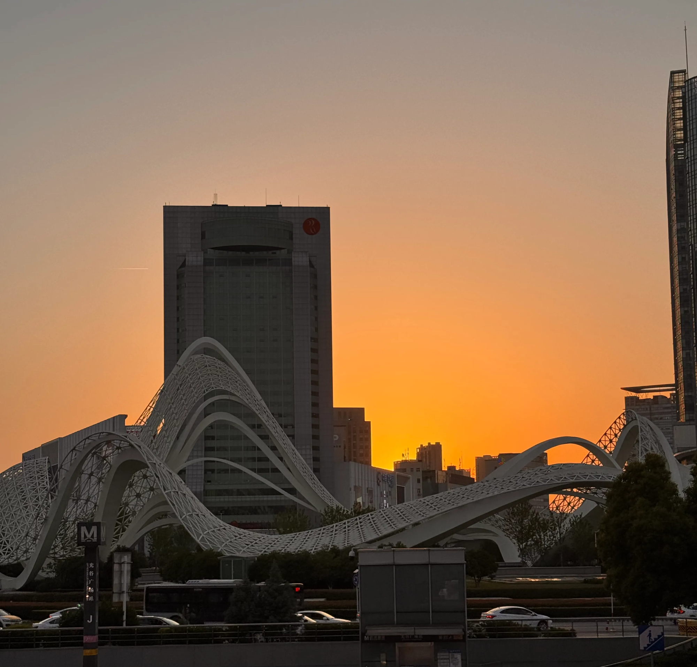

次日才是真正的地狱难度节假日，快到午饭时间终于走下摇摇晃晃的公交，带着四汪和阿藕到万松园过“早”，说是早但却已经是大中午，一路半遮半晒着吃过热干面、鸡冠饺和生煎包，最终还是没能挨过烈日，但却因此收获四杯因超时而免单的茶颜柠檬茶，好像感觉到本来炎热的天气多了一分凉爽。

随后赶往古德寺和黄浦路更是排山倒海般的人潮，最终穿过新天地的商业板块、江滩还算是有份清凉。唯独可惜的是我榜单中的湖北菜馆菜式已经全换，再吃不到初到武汉时候的那份藕条，最近几天更是发现这家店已经完全倒闭了，至此，不管是有多遗憾的胃没有被满足都也没有任何挽回的余地，可惜在没有许你们一个如虎头周末般还算惬意的一天。

端午假期结束的后一周末，85 带着柴猫找补了一下五一没能兑现的约定。倒是也算时机凑巧，可能是下雨的天气还算惬意，舒适的温度还有饱餐都让这短短的周末显得无比充实，还是一样的一杯红苹果伴着晚风，还是虎头窝里一样的热闹。

多出来的是到武汉三年才第一次尝试的黑鸭煲，看着有人不停的灌水，还有烤串局不停摆手的样子，饭量也就那样吧~

年中六月，在去年 REWIND 中给了我很大启发的 Frank 早于我预期的时间来赴约初识时的一句“欢迎来玩”。

挑了一个刚好周三上午开完会的下午休息半天去接车，这张几个月前定制的公交卡终于派上了用场。因为约定好一定会来所以提前准备好的东西一定会派上用场。

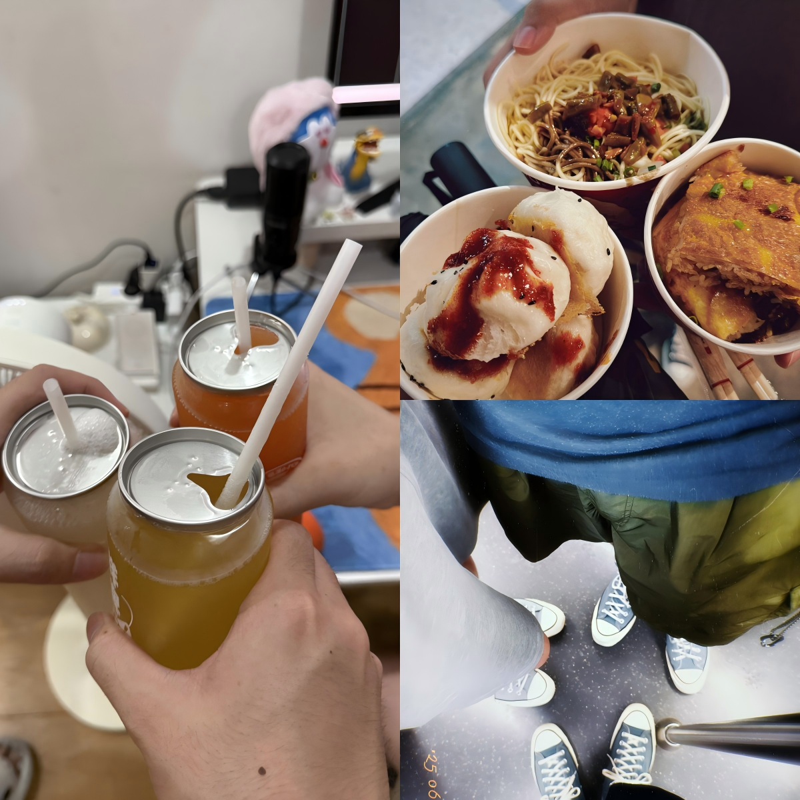

十余天里慢慢穿过武汉的大街小巷，走过我平常的生活和工作角落。又迎着雨夜在江边细细感受桥的声音，一觉醒后在下午体验一派江城过早、再路过巴公府尝一份一豆两制，冒着大太阳闯进还未开始泛白的芦苇，坦率出这份心意被拒收之后的坦白。

以及你说的那句：“这是我第一次，没有和家人一起出门，第独自与朋友的一次旅行。”

机缘巧合地认识了同在江城的景和与 OTTO，可惜在各家有自己难念的经，但还是在和景和的一次午饭见面后就选定了这么一个周五。

只是简单的晚饭后一起闲逛几家谷子店，在家做客而已，却也不知不觉到天色太晚，顶着狂风暴雨送下的一把雨伞是我为数不多还能做到的事情，毕竟之后的路你们还要一起走很久。

待到暑假正盛，刚好有这么一个机会能够回到长沙和瑞秋闪星叙旧，还没走出人流就已经看到熟悉的面孔。

还没顾着找到哪里有辣椒炒肉粉就被茶颜饼坊勾到走不动路…… 鸳央咖啡、彭耕记、有凉风、夜市薄饼和臭豆腐、肉蛋粉、黄油啤酒、仰望咖啡、广殿鱼丸……最后又是饼坊和鸳央收尾。

本来想说只是一个平凡又幸福的四人周末，结果回想起来怎么又是吃了如此多的东西啊，我就这样吃的和品牌混在一起，长沙我还会再来吃的，还是我们四个。

又是一周，卡鱼逮着我们刚好空出来的周末赴约，记得最初还在被Frank调侃说应该只是出于礼貌性的回复，但我就是觉得一定会来赴约。

回想一下这周末好像也太多事情凑巧了，刚好赶上坏蛋联盟2的上映，跨江用甜品代替午餐后刚好是绝区零的快闪活动，逛谷店刚好又拿下了盒内余量一发就出了的塔尔斯，这么多事情凑在一起，像是一个美好的不真实的周六，好像上面说到的再没有过从早玩到晚的一天，就是和你一起的这一天。

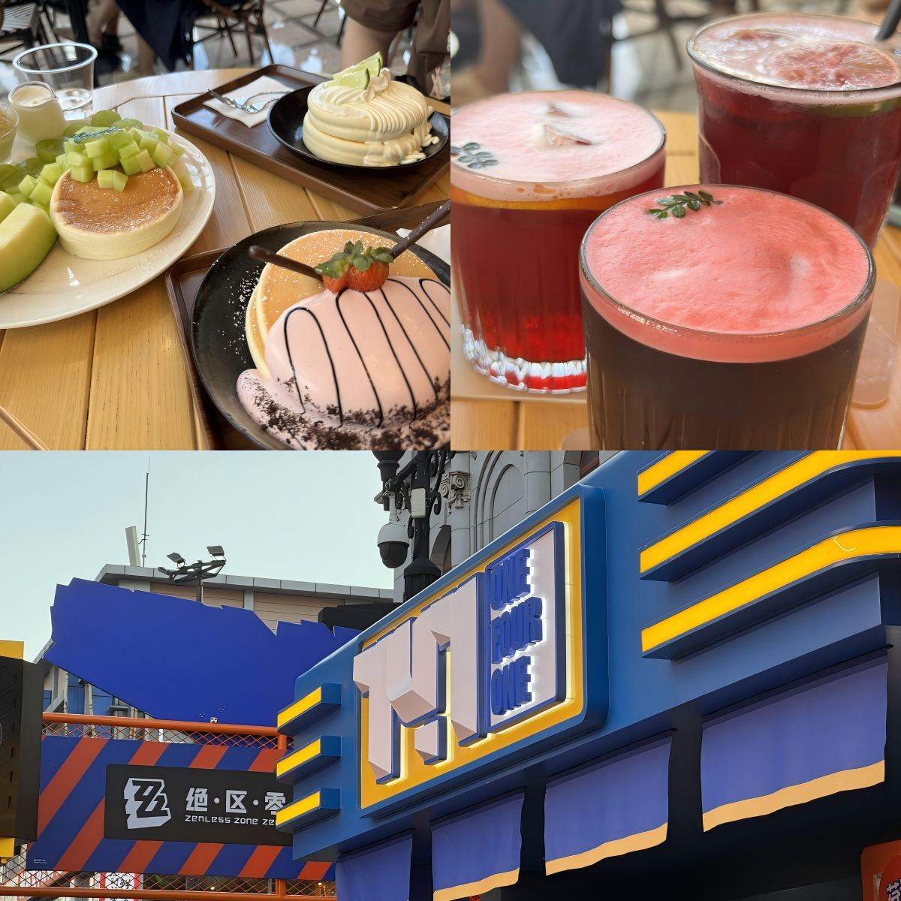

之后便快到了国庆长假，本没打算安排的假期因为虎的请求又多了几分期待，这程选择了反人潮到咸宁的民宿小院也许是这一年最不虚此行的记忆。

四人在武汉聚齐后愣是按照非常规时间出门逛街，回想起来倒是也没有遇到过人特别多的时候，喝酒吃肉、Shopping Mall里逛来逛去，赶着热闹把两个新开的商业都逛了一遍，再把店里的试用荧光笔涂涂画画，把墙上的冰箱贴拼出来每个人名字里的字希望对方发财，就这样晃过三天。

小城的人气和想象中的相差无几，虽然是人比较多的节假日，倒也还算有点过节的样子，有几分愿意混入其中的热闹。没有特定目的地的旅行反而才会更加舒适。一起为Frank庆生，一起举杯祝愿你美好的新一岁，一起在林间小路漫步遮阳，一起闲着就等着时间这样溜走。

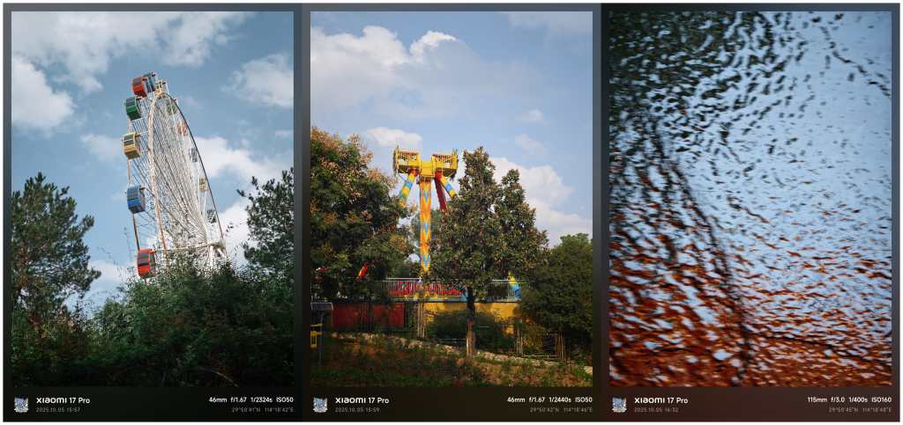

终于赶上一个周末，把同校的哈库和Tony老师约了见面，虽然早就已经互相知道了对方的存在但是一直没有凑出来一个合适的时间一起见面。没在放寒暑假的盛香亭转转热卤轻易就是几十一百桌的排号，只好退而求其次随便吃了另外的一家。只是午饭后不久实在没有太大的食欲，不过好在也只是地铁站的距离，虽然在同一个城市但并没有多么频繁的约见，但至少还算方便。

晚秋时分，TON如期赴约在江城的一个普通周末。本是为了途径异宠医院而改变的行程，因为一点疲惫暂时还是没能前去。约定好吃些甜品舔一下肚子结果只是靠半块可颂挞就已经撑的不行，实在是忍不住说了一句饭量好弱，倒是晚饭吃的很多我非常认可了。

次日提起想要看的好像只有长江大桥，好在沿途的早饭还算可口，哆啦A梦和甜品的点缀也恰如其分；主题店也还算好逛，只是这杯抹茶味道对你来说实在不算可口。

转眼就是圣诞节，提起想要看看SNS上刷到的圣诞树，时间也刚刚好卡在圣诞当晚，可惜一不留神就煮沸的热红酒已经散尽该有的香气只留下酸涩。

但是牛肉粉还热乎、鸡翅也入味，citywalk刚好穿过老里份，抄手味道刚刚好、暖手的咖啡、热茶、还有摊主赠饮的梅酒被下午时分的阳光镀上了一层淡金色。

---

终于配置完最后一条规则，冲向地铁站却发现跨年夜竟然零零星星地开始下起了小雨，心里凉了半截。早在这一晚到来时候就在暗暗计划着，从小到大的跨年夜从来都没有真正体验过一起倒数这种环节，虽然倒数也只是倒数而已，不会因为挤在这里发生什么变化，但也许就会有些时候很期待这样的时刻吧。

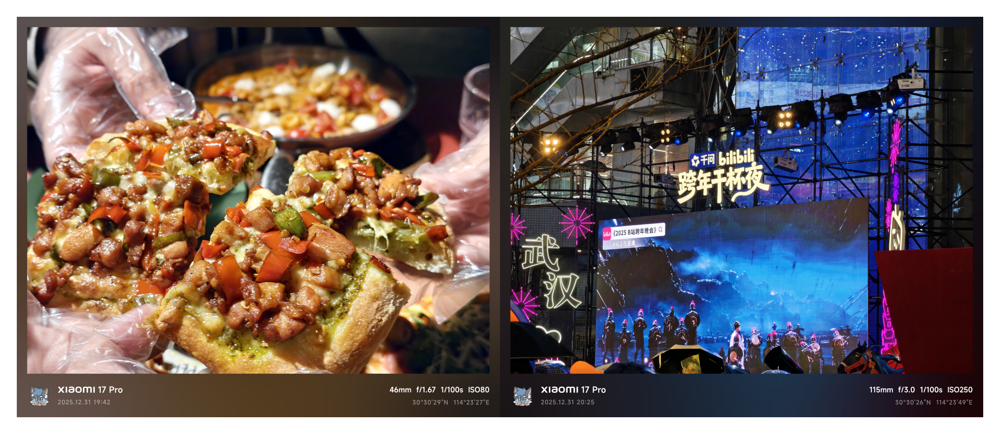

冲进地铁、等到站、冲下地铁，趁等位的时候没注意从背后偷袭了一下，一边发出哼哼呜呜的声音一边互道着好久没见，我好想你。说笑间终于还是等到餐位，门外是冬夜小雨淅淅沥沥、桌上是披萨烤鸡和朋友正举杯等你。饱餐一顿闲逛几刻杀杀时间，雨却还是没有停下来的样子；只好等到过晚9点的冰淇淋买一送一捎带着扫兴回家好了。

不过晚饭时间倒是有头偷做好多余的打算；提前买好了几份冰杯和零食，虽然雨还一直下，好在虎头窝还算温暖。

先是朗姆再是糖浆、最后又是气泡酒和果汁，喝下去才知道这杯到底有多少度；微醺着看着时间快要到那一刻，一起看着计时，然后碰杯。

真好哇，又是精彩的一年。

---

还是经常会觉得：比起提防，主动释放善意也许是更轻松的方式，久而久之也就靠这样交到了不少朋友。在再不能多喝下一杯奶茶、再没办法多吃下一包零食、再没力气随手多拿一个快递的一些瞬间突然意识到：原来有这么多的朋友一直在陪着我，也会有因为这些幸福的事情而感到烦恼的时候，一直以来，一直都有被大家好好地爱着。

和朋友在一起的时间，美好的回忆会成为友情的见证，而那些不好的又会怎么样。

也会深深刻入脑海，可能某次深夜没有入眠的时候回想起当时的情形又会自己在脑子里和假想敌争吵一万次；但是直到下一次约定好见面的时候又会就这样轻轻放下，先度过这一刻钟的美好。写下这一句话的时候刚刚和朋友交待了上一次不满的情绪缘起为何，但是直到再见面的那一刻又会觉得只想要一把抱着，强忍一下不知道是因为盯着显示器太久还是什么别的原因有点酸胀的眼睛。

不管怎么样，到最后都是因为有在深深挂念着对方，无法割舍掉的这一部分情感暂时占据了理性思考的上路。成为疤痕也好，成为笑料谈资也好，最终都是与你们共度和成长的「我」。

---

## 这样的一年、「我」留下的是什么。

翻看相册挑挑拣拣才意识到，不知不觉度过了怎么样的一年。

像往年一样，除了有部分与朋友一起的照片已经在上一部分，还有下面在当时记录下发生的故事。

### 一年的开始、武汉双年展

说起来也很巧，在三年前的这个时候刚好赶上的是2022-2023武汉双年展，这次刚好是2024-2025。

时间过得真快呢，即将到来的下一次双年展会有你来看吗？

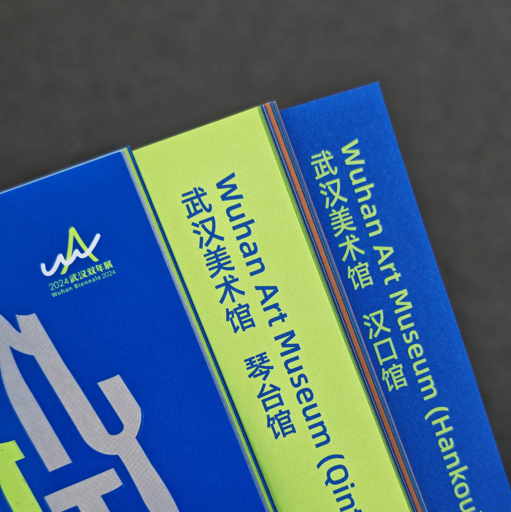

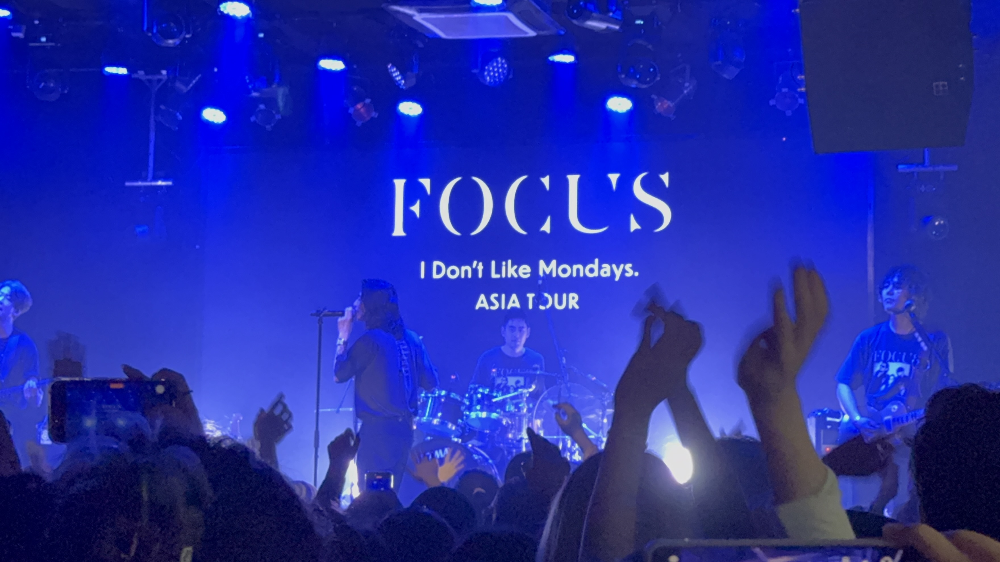

### I Don’t Like Mondays 武汉公演

一次偶然的秀动推送注意到了他们将在武汉开一场livehouse的推送，对这个乐队的印象很好的原因是有一首《迷上了青空之蓝》很好听，很自由的感觉。现场也是非常畅快的爽。

唯一可惜的是本来的双人票因为虎的加班没能派上用场，实在可惜。

### 一起一起再一起

第三个2.14，

比阳光更温暖的还是你的臂弯。

### 几百年可能都没心思拼一次的拼图

是来自四夕的礼物，当晚和虎吐槽说不知道啥时候才能记起来拼，最终还是说完这句话就开始拼了几分之一，第二天晚上吭哧吭哧最终还是拼完了。嗯…还是他眼疾手快，我找半天才找出来。

### 某个颇有兴致的夜晚

因为觉得需要稍微运动一下，所以干脆在那个突然下雨的晚上选择从公司步行走回了家，一路上看着路上的样子。好像在有地铁的城市里，经常会忘记一路上本来会有些什么东西。沿路走过发现自己上班时候经常点的外卖原来就这样星星点点的分布在街上，顺带凑近筛选了一波看着还算放心的。

### REWIND 2024 立绘实体化

是来自Frank的立牌设计，很巧妙的把武汉地图、ID、bio个签柔和在组合立牌的底座、背景还有插件上。可惜的是该立牌并未量产，也许会有头友有想要的吗有机会调研一下什么的（真的会吗）。

### 敬麦麦

麦门伟大无需多言、干杯！

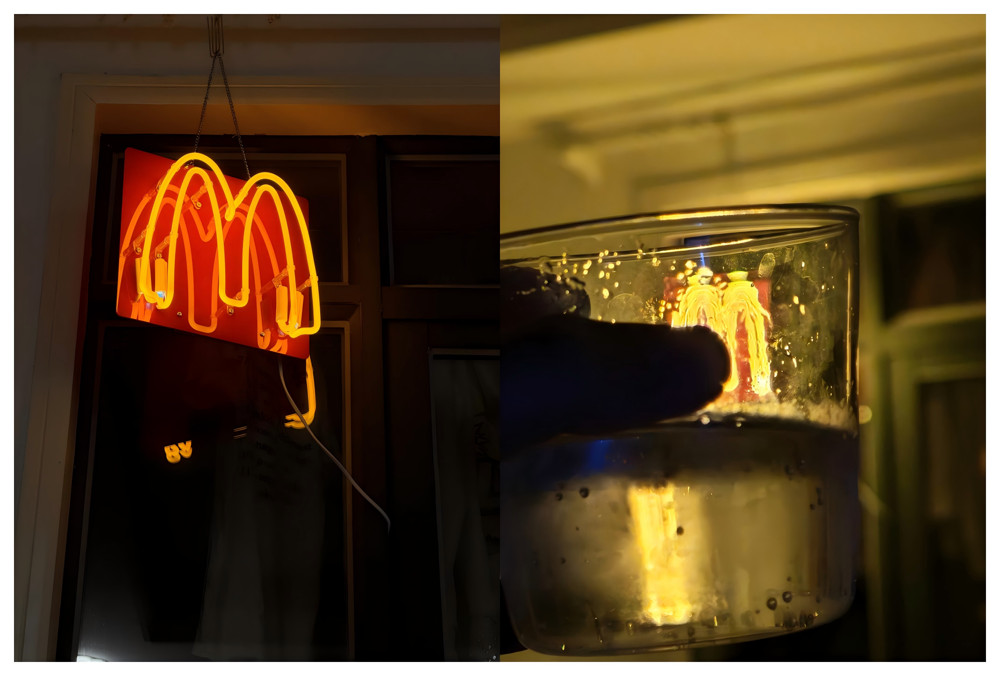

### 别和傻子玩双影奇境

是的我说的就是我自己，别和我打游戏真的因为我自己打着打着就会破防了，太菜了。

但是今年会有地平线6！已经美美预购了，期待一下！

### 又是一年樱花季

比起今年的樱花，更感慨的应该是每一次的相遇。与其说约定一起看樱花，不如说是约定一起看春暖花开，迎接新的一年。

EMO/一毛是一朵胖樱花，是由武汉一位独立艺术家创作的角色，由于关注到了这个故事所以开始在武汉的大街小巷里注意，经常会看到这朵胖樱花的涂鸦在城市各个角落。每每发现时都有一阵惊喜，更好的是能够转身拉着衣角叫你来看。

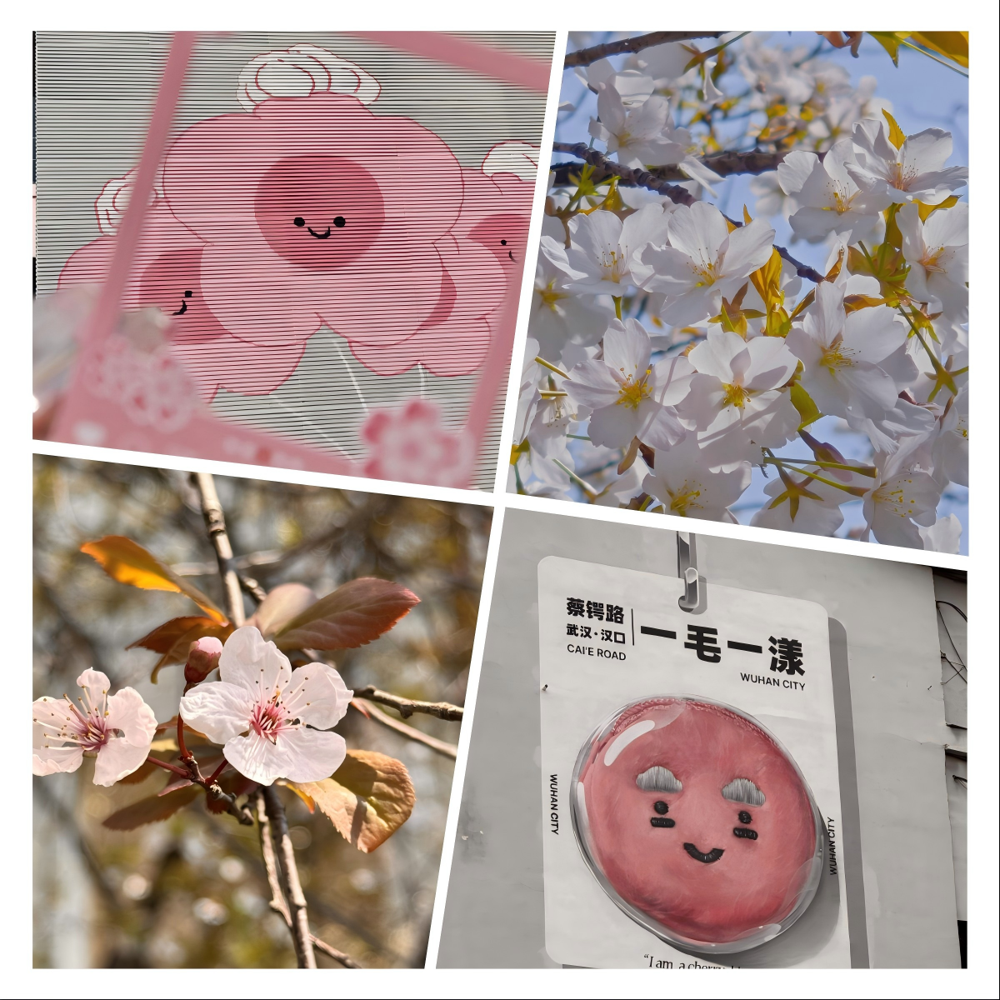

### 五一小假的委托稿

上面请上地铁的双人（其实是两个单人）是灰灰劳斯约赠的！非常可爱非常有一种尽地主之谊的感觉。虽然其实我也是外码哈，除了周末和休息其他时间的活动范围基本都是在光谷附近，老武汉人称郊区/美食荒漠。（不过荒漠的优点就在于人还算少）总之也很希望可以记录下这次很多人的小长假，所以委托了这一张~

### 不要再买绝区零周边了

话虽如此但是还是在持续购买，应该是第一个从游戏刚出就开始一直坚持玩到现在的游戏。周边和联动也是不落下就都all-in，说到底当时入坑是因为莱卡恩很帅啊，但是玩到现在感觉最大的还是玩起来很爽快，美术风格和配乐也都很喜欢。再买一点再买一点……

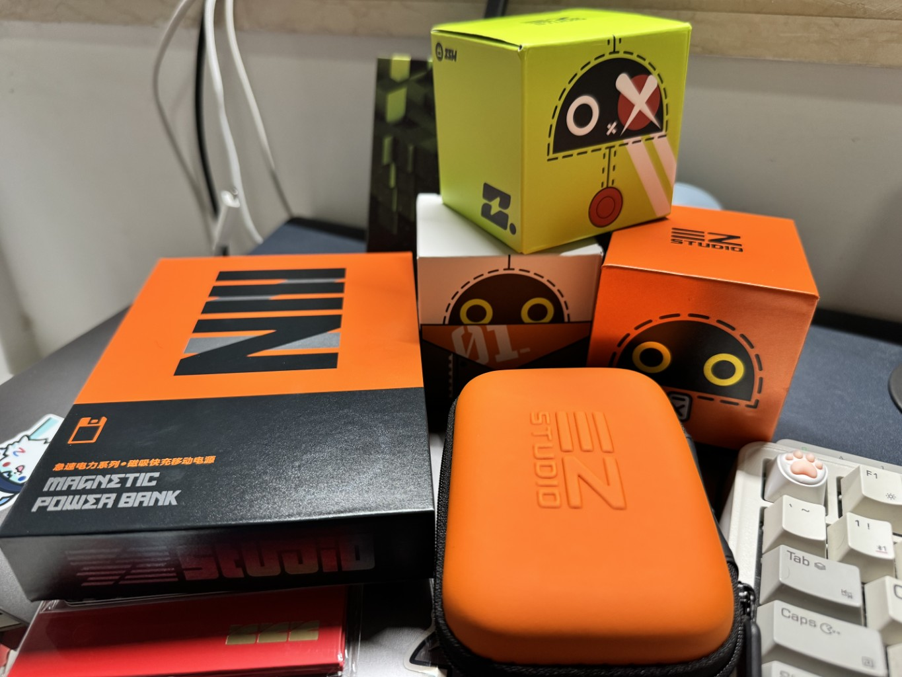

### 5.21 特别插图

同样由出稿巨巨巨巨巨快地Frank绘制，晴时雨分的意象也伴随着我们数个日夜的生活。比起幻想的世界观来说，没有什么比踏实地共同生活更美好吧。

### 端午后一周

是上文里提到的黑鸭煲与烤串的后续，这里＝和❌的意思是：要分一分烤串吗，不要不要。

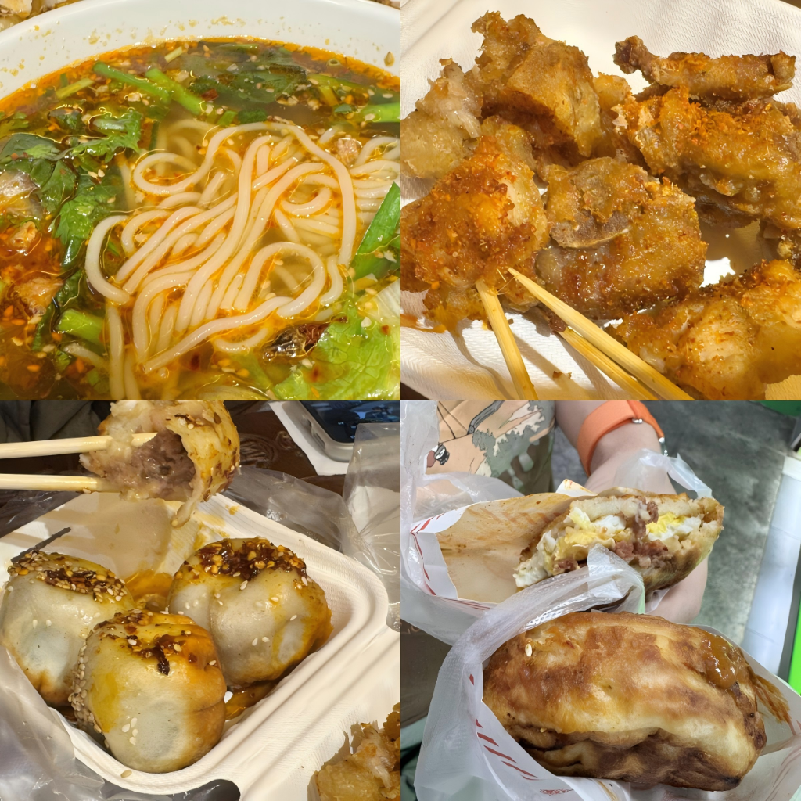

### 一个普通周五的夜市逛吃

财大小吃街~ 应该也是武汉比较有名的小吃街了，偶然一个周五下班时虎突然提议要去，倒是感觉时间刚好。显示肉蛋堡、生煎包和炸排骨、又是鲜米线，从天亮吃到了太阳下山，舒服~

### 盛夏未尽

上文里提到的景和绘制的半委半赠图，本意只是担任委托但是被对方说感觉很好嗑所以决定多画上虎。延续了5.21的意象，撑伞过后阳光洒落时的一杯冷饮和一支雪糕，这样才是盛夏。

### 又一个堆满冷饮的夏日

正如上文提到过的，芬达你这次和绝的联动真的是联动过的这么多品牌里最差的！不如麦当劳用心、不如茶百道工艺、不如荷美尔丰富；就先不说为了一套吧唧和透卡要买两箱一共48罐芬达了，游戏内道具甚至要我至少买6瓶才能抽到一个…头像加名片？现在冰箱里还剩了几罐，联的很用心下次别联了！

### 有意思的3C +1

有话说：当你在纠结要不要时，还是想要。当然这句话反着说也没问题，可是谁能刚好在想要的时候刷出来同城的闲鱼上比期望价格还要便宜100块而且卖家不到10分钟就送到手直接面交的爽快呢。

事实证明 Nothing Phone (3a) 这个配置对于用习惯了小米数字系列的我来说还算堪用，只是不太“本土化”的软件在国产毒瘤的加持下一天时间也只是勉强够用。包括背板的Glyph Interface指示灯还蛮有特色的，到手实际体验大于期望的一款产品。不过意外倒是发现这个颜色和图上委托还挺配的，也算是一种痛机？

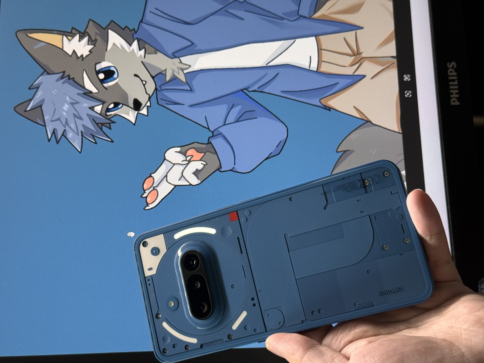

### 超级好喝的鱼丸汤！

熟悉主包的都知道出门属于能不吃鱼就不吃鱼的程度，也许是太久没吃过鱼了吗，在上文提到的暑期在长沙的一个周末的时候，被瑞秋宝带着去喝。

这个鱼丸汤在我这里应该是属于T0的水平，完全没有腥味，只有本身的鲜甜。泡饭也是一等一的好吃啊，特别舒服，下次还想吃。

### AOP可颂挞！

是喜茶目前还属于Lab烘焙店铺的新单品，十分浓郁的烘焙原料以及和果茶奶茶同源的配料，简直像在吃奶茶一样。目前仅在北京、深圳和武汉的三家店铺有售，喜欢这种甜品的朋友如果有机会一定要试试看！😋

### 买谷！买谷！

以上提到的与卡鱼一起刚好赶上绝区零快闪和开出塔尔斯的一个周六，在歇脚时顺手拍下的三人合影进行了一个furry画，耶( •̀ ω •́ )y

### 微醺着上班

因为公司附近的便利店在夏天的时候有任意购买+1元换购冰杯的活动，当时经常会在中午午饭过后随便买点什么带个冰杯。偶然一次选了这罐低度数的气泡酒，配合冰杯刚好可以喝两杯的样子；然后下午上班的时候就会感觉有点晕晕乎乎的。不过一般还是在没什么事情的时候这么做，如果上午特别忙忙不过来或者明知下午有很重要的事情还是不建议这么做的哈。

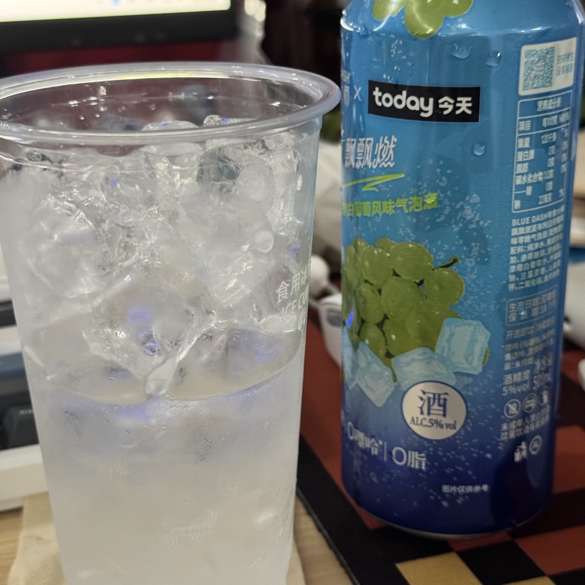

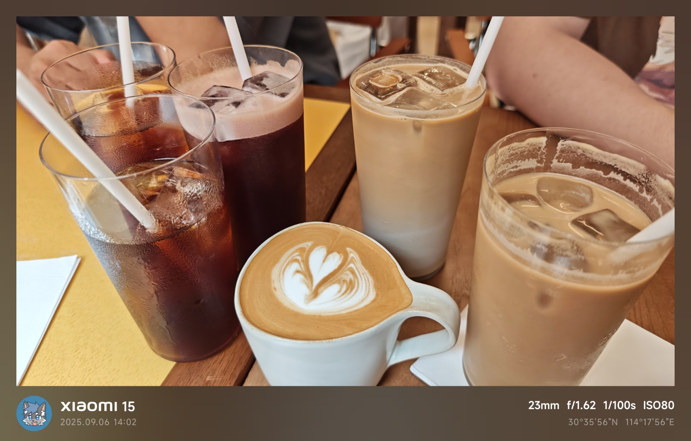

### 咖啡也要畅饮吗？

是的没错，来自本地烘焙工厂的咖啡小店。

每次去都会至少点单两次，喝个尽兴！

### 背屏？背屏！

最后还是在国庆假期结束前一起换上了背屏，一种痛机。

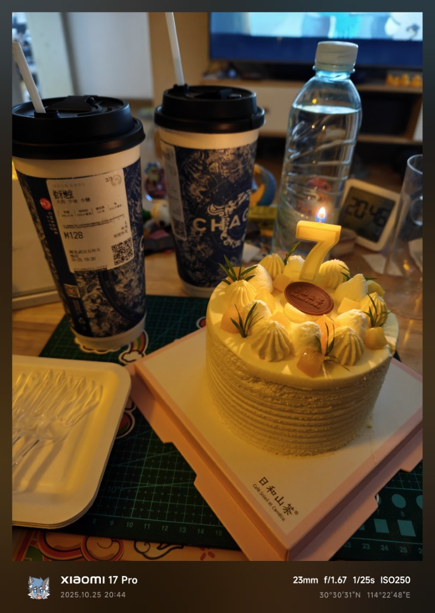

### 😘

陪虎一起的第三个生日

在生日的那个周末逛到打算买的橘鲨猫，还有鳐鱼，但是线下买太大号了最终还是淘宝。

此照未经过虎同意就放上来了，看到了就是我没被打看不到就是我被殴了，且看且珍惜吧。

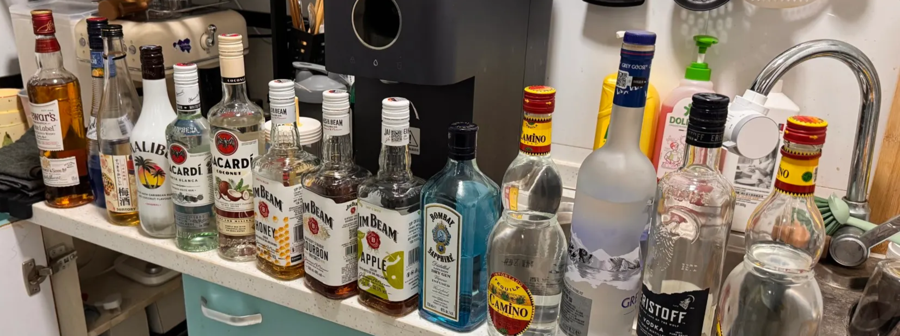

### 喝！

在前一年亨特经常来玩的时候就有利用职务之便买了很多酒（并非），自那之后感觉酒柜没空过，除了本来的基酒，还有朗姆、金宾等会时不时补充，不知不觉就变成了酒鬼头头啊。

### 喝过太妃

就要准备开始过冬啦

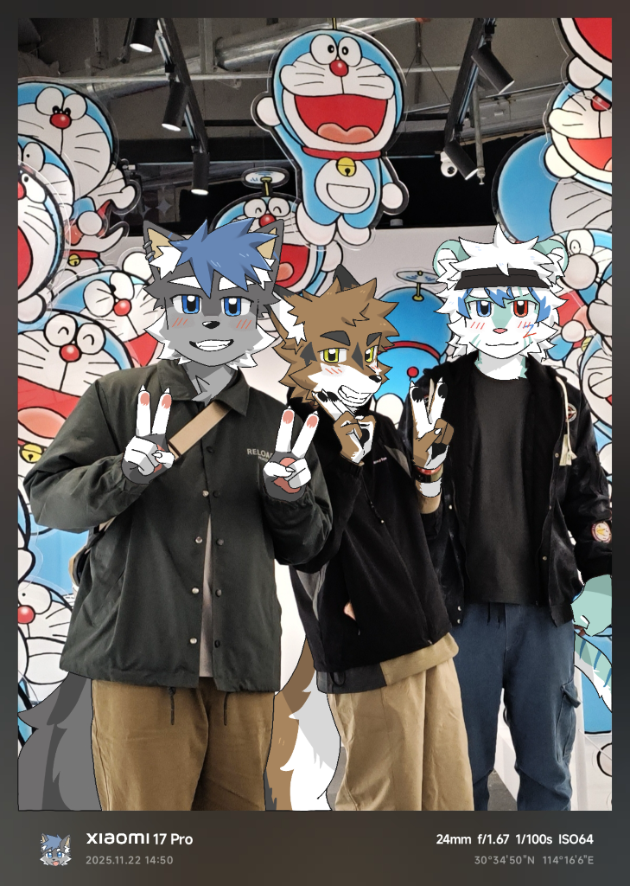

### 100% 哆啦A梦 in 武汉

刚好是在TON第一次来的时间节点开始了全国巡展的武汉站，虽然并非哆啦A梦的粉丝但是谁还没有看过几集哆啦A梦呢。

### 含头量100%

全部——都是Frank亲自设计、打样的头头亚克力立牌（坐牌），客观您要来一份吗。（并未锐意生产中）

### 十足的薯饼头

2025年初麦当劳宣布薯饼将会加入全天供应，但是因为油炸的温度问题最终还是没能全天供应。不过变成了会隔段时间返场上架半个月的样子，也还行吧属于是稍微等一小段时间就可以爽吃的程度。麦满分夹薯饼yyds

### 熊！

实际为戴泽先生在武汉美术馆（汉口馆）的美术展，很佩服策展人的呈现，很温暖的一场美术展。

### 圣诞树形的圣诞酒

实际度数10°的小甜白，加冰非常嚎喝。

### 辣椒小炒鸡拌面

在纠结晚饭吃什么时在大众点评刷到的，遂和时任男大的卡鱼一起穿过小路找到了这家店。

坐下放不直腿的矮凳、不锈钢材质反光的餐桌、还有免费续面，最主要的是感觉店里全部都是大学生。想起来自己大学时候也经常和朋友一起下课之后午间休息到这种店里拼单吃干锅和鸡公煲的日子，可惜早已不再男大。

### 有意思的3C再 +1

薄，除了薄还是薄。Hooo师傅说当有产品愿意为了一个指标卷到底的时候就会有人买单，更不用说我已经为了买一个磁吸充电宝从 13 mini 试错到 15 Pro，应该是毕业级别的磁吸充电宝了。

### 25 岁

有人说，24岁是一个很特别的年龄：因为它距离18岁和30岁一样久。前半段是青春，后半段要学会走向成熟。在上一次写下这句话的时候还并未25岁，当然现在也已经要过完25岁的十分之一了，时间真的很快吧。不知道这一年会是怎么样的一年，我也不知道我有没有准备好迈向成熟。但是没关系，走向我自己的路就好。

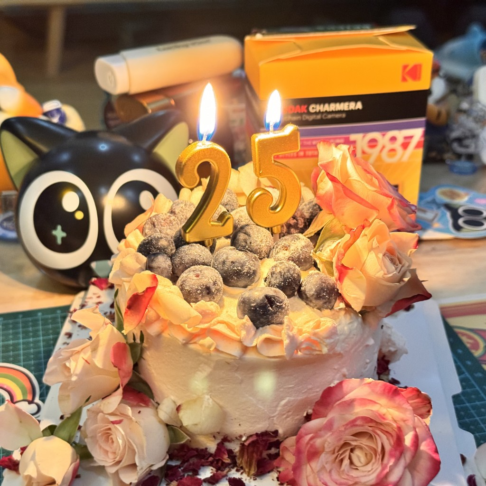

### 冬至羊肉汤~

虎说为什么冬至要喝羊肉汤，我说不是有这种冬至吃饺子喝羊肉汤的习俗吗，去年就是。

被虎接话说湖北没有什么羊吧，大概也没有喝羊肉汤的习惯。我想也许只是因为去年冬至和朋友们一起喝过吧，今年也不自觉地喝上了。

### 圣诞热红酒~

这份是没有煮沸还算好喝的那一杯，下次再喝我一定会看着火不煮过头的）

### 圣诞树

赶上了~ 

希望明年也要一起过圣诞呀。

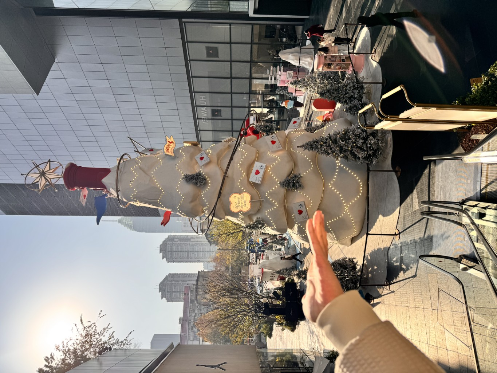

### 新的一年

跨年已经在上面讲过了，就用瑞秋宝的月历开始新的这一年吧。

---

## 还有一些因为委托认识的朋友~

上面图片中的照片以及痛机插画都是这位 TSURU汀 创作的！偶然一次刷委托平台时看到了特别可爱的组合页，遂委托。在这之后也经常时不时地骚扰不停塞朋友的委托和委托照片插画，配图的小短漫是国庆假期后收到的赠图，汀老师来年也多多画我好吗好的好的~

这张组合页由司南/Kompass-CAT绘制！虽然是还在上学的朋友但是在校时还经常会时不时摸鱼把我画在草稿本上拍给我看，先不说画的可爱主要是好恐怖的产能速度啊老大你画的也太快了。

特别感谢圆我男高梦的拓司老师，意外收到了这张校园主题的双人插图。不记得有没有讲过之前有考虑继续读书的一个原因就是：很想谈一场校园恋爱，但是最后实在是没有达成吧。更大一个原因是现在的生活和关系已经足够好，收到这张图也算是圆梦了~

---

还有所有为我画了生日贺图的朋友们—— 感恩！

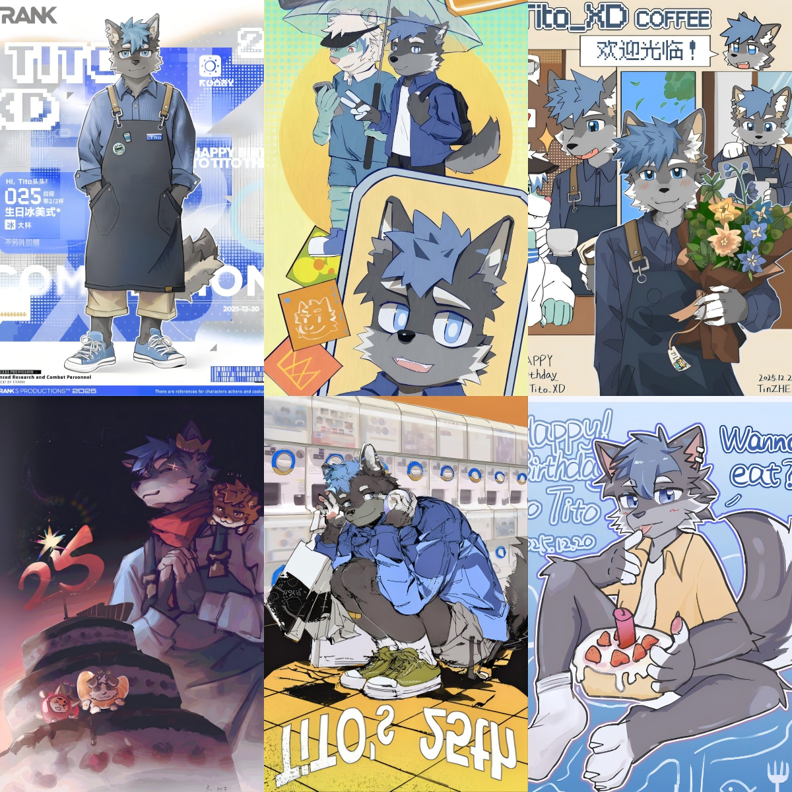

---

## 最后的废话

在构思写些什么东西的时候，想的很多却落到键盘上很少。最后还是在周二晚上不知道因为什么有点失眠，一边写一边把之前的内容全部推翻了个遍。

最开始在看到“七分之五的人生”这个说法时，原定的小标题是“七分之五的生活”、“百分之百与你”和“二成九的羁绊”，分别对应以上三段内容。但是在写到这里时看到关于七分之五人生的评论回复，仔细思索一番后还是改成了现在看起来略显平淡的标题。

如果认可七分之五人生本身的意义，那这段时间就不算是在虚度。就像开头首先写到工作就是因为在这之后的所有幸福与纠结、精彩或无奈都是有工作作为必要条件或阻力在这之中的。我无法否认它对我生活的影响，以及对我提供的基本支持；但这并不全是因为工作本身有意义，而是因为生活中的方方面面都是耦合在一起的，期待工作结束后的休憩或者某个半天假里见到朋友的心情，才是真正的意义。

工作的我、生活的我、两人的我、朋友的我；所有这样的我组成走在下一段旅途上的我。

---

### 以上，2025 的「这些我、组成我」。
