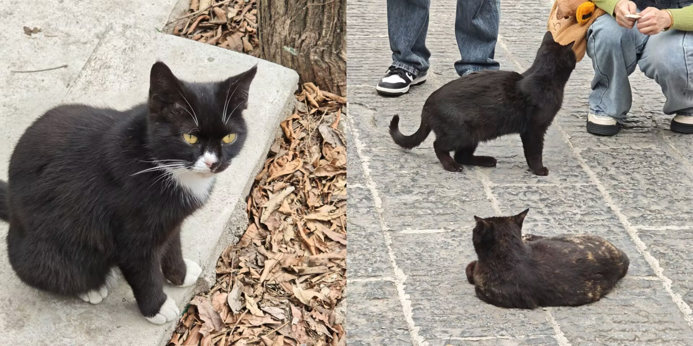

---

周末时间感觉过得又快又慢：快是因为只有两天，想要充足的睡眠，把其余醒着的时间加起来不过24小时；慢是因为有在尽力去感受生活，所以每一秒都体会到了流逝过指尖的感觉。
周六是二月初二龙抬头，遵照家里的习惯在这一天剪了头发，感觉大约是天气要热起来了，下一次也许就要剪得再清爽一点。过后去看了《Flow》/《猫猫的奇幻漂流》，引朋友所言，相当”禅意“，很多隐喻；可惜我没带脑子去看，整部影片都没有离开水，看久了总觉得很压抑，好像掉进水中的不是猫猫而是我，先叠甲：没有说电影不好的意思，是我没看懂。回家路上朋友提起自己的这一天，虽然是奇怪的升温天气，却也踩上一双新鞋子轻装出门晃悠，难得的周末没有待在家里而是感受一下阳光拂过皮肤的感觉，也很不错；也有在好好生活着。
出门、吃饭、剪发、电影、晚饭，一个平凡且充实的周六，晚饭过后回家路上，提起了工作的事情，他现在的工作压力不算小，虽然说加班可能是程序员常态，但总觉得有点过于辛苦了，他的心情捉摸不定，我也不知道应该站在哪一边支持他。总归觉得两人对于对方的工作还是有无法理解的地方，虽是同一专业但并非同一岗位，他工作时的沉着冷静思考也许正是我缺少的，我工作时的主动争取提议也许也是他缺少的，两个人做着截然不同的职位但是带着同一出发点，又相互试着体谅对方，很难很难。不难的是，只要记着我们总是坚定地站在同一个方向就好：向着对方的方向。

周日跑到了几站地铁外的地方，虽然来到这个城市两年有余，但却从未在这个地方驻足观察过，号称"亚洲最大"的商圈，在我看来也不过是大号食堂罢了，倒是在对面的寺庙山坡处闲逛登高，一路上看看睡觉的小猫感觉格外惬意。传几张照片给好友，被问到怎么都是黑色小猫，想了想也许是被游客来往烧香熏黑烤焦了罢。

信步回到家中，翻看着电视节目后又躺在床上小憩，醒来还未到晚饭时间，遂又睡了过去。不知怎么的时间就过去了，想到闭眼睁眼又是不知道什么时候才能做完的工作，总归有点烦闷。

每周末都是如此，算不算是一件好事呢？

也许并不重要，那一刻的我们都在认真生活，这就够了。