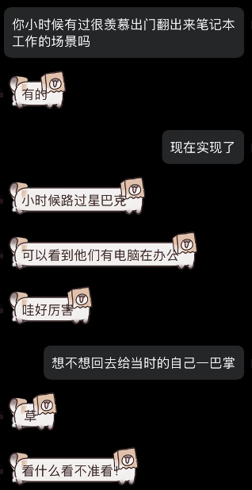

---

### 现在实现了

和做广告投流的朋友闲聊起来，因为同是负责海外的内容，所以工作内容会有些许重合，不过由于他的职业特殊性工作时间会有些不正常。经常需要在休息时间里盯数据盯状态，即使是出门玩也要带着电脑，想起来小时候跟着家里人看的都市剧里经常会出现的掏出笔记本后随地大小办（公），当时也会觉得哇看起来好厉害的样子，现在却真的做起来这样的工作，何尝不是一种反噬呢（

### 咖啡……过萃了

想不太起来是什么时候开始偶尔和咖啡捆绑出现的，仔细回想，自己对于咖啡的一些兴趣在工作之后逐渐兴起而后又消耗了很多……最早的时候会有心思每天在家里按照不同方法去制作，后来习惯了工作时候顺手带杯做早餐，从很早的几日一杯、每日一杯到每天几杯，渐渐地不会因为咖啡因摄入的问题影响睡眠，总归不太确定是不是一件好事，偶尔晚上嘴馋的时候会换用低因的豆子，也许只是贪图一点这种微苦的味道吧。

前日晚在等下班回家的他时，提起做一杯来喝，拿起旁边已经见底的一袋豆子，或许是因为拆封太久，油脂已经散失很多，倒入磨子时手感非常生涩，但却也忘记了调节粉末粗细，就这样子磨完了。铺粉、压实，忘了布粉与垫滤纸、也忘了预热冲煮头，最后得到了一杯看起来显然浓度略差的寡淡浓缩。

好在牛奶加热后很香很香，最终也是成了一杯苦味略淡却很温暖的拿铁吧。

仔细想想，喝了这么久很大程度上也只是满足自己的口味，没办法品出不同豆子里那么细微的差异、到现在也没有好好学习拉花、手冲意式冷萃也是按心情选择，实话说，本站名字叫 Tito's Cafe/头头咖啡屋 或许也不是很贴切，毕竟主包也不是一个很精通咖啡的人。但是总会觉得比起blog、space等等的字眼这个名字更加生活一点，通人味。

也许终究都不会很精通，但是也没关系的嘛，只是喜欢就好了，至于你来的话，我请你喝一杯就好~